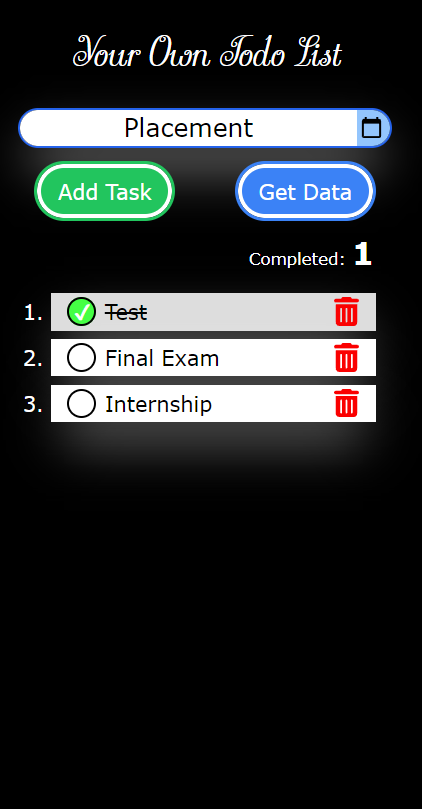
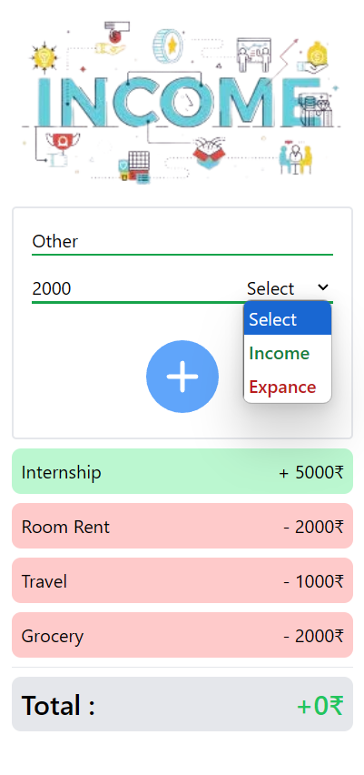
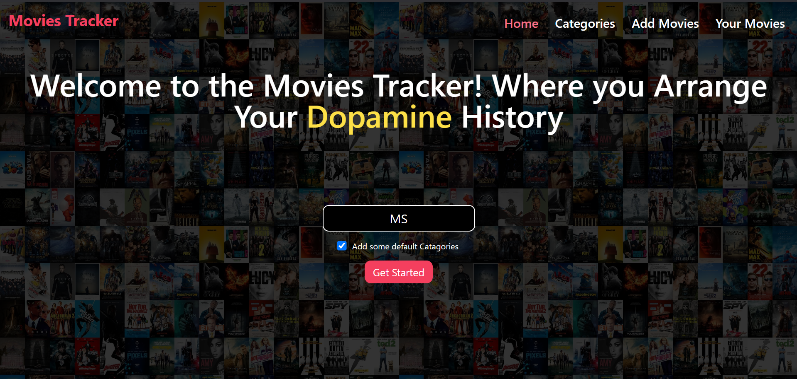

# Some Starting Expereince in Web Devlopment

These are those projects that i initially build during learning of web Devlopment with Understanding DOM (Document Object Model) and concept of JavaScript Language and Tailwind.

## Some Simple Projects

### 1. [Task Manager (A Todo App)](https://sahilkhan117.github.io/WEB-by-CyberDairy/Task_Manager/)

### 2. [Income Expense Tracker](https://sahilkhan117.github.io/WEB-by-CyberDairy/IE-Tracker/)

### 3. [Movies Tracker](https://sahilkhan117.github.io/WEB-by-CyberDairy/Movies-Tracker/)

